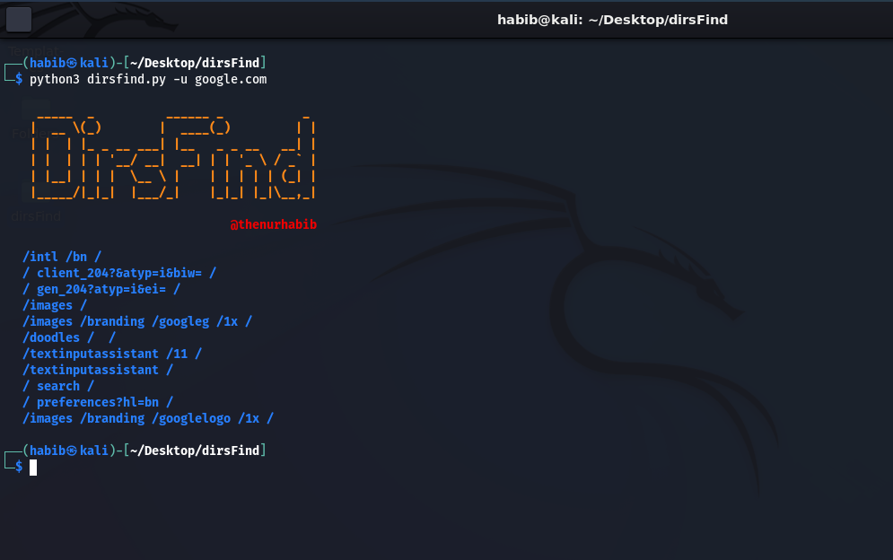
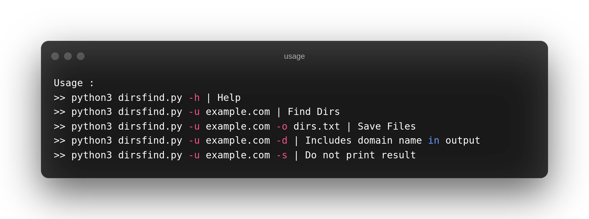
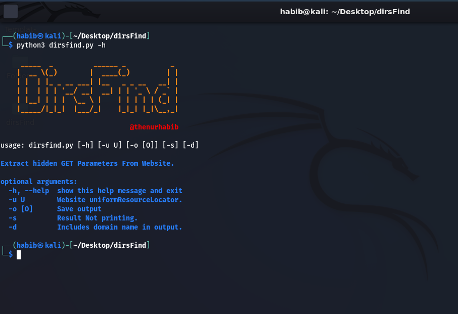

# DirsFind

### Find hidden directories from domain and subdomain.

## Demo

```bash
python3 dirsfind.py -h | Help
python3 dirsfind.py -u example.com | Find Dirs
python3 dirsfind.py -u example.com -o dirs.txt | Save Files
python3 dirsfind.py -u example.com -d | Includes domain name in output
python3 dirsfind.py -u example.com -s | Do not print result
```

<br>



## Features

- Find Directories from JS File.
- Find hidden Directories from subdomain or domain.


## Installation

Install dirsFind with git clone

```bash
  git clone https://github.com/thenurhabib/dirsfind
  cd dirsfind
  python3 dirsfind.py --help
```
### Usage :
```bash
python3 dirsfind.py -u <domain>
example :python3 dirsfind.py example.com
```

<be>



## 🔗 Links
[](https://www.linkedin.com/in/thenurhabib)
[](https://twitter.com/thenurhab1b)

